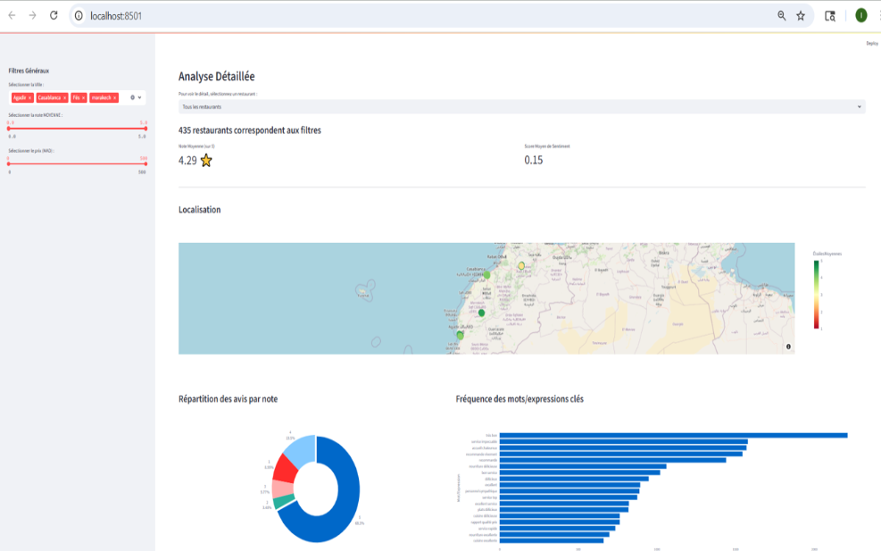
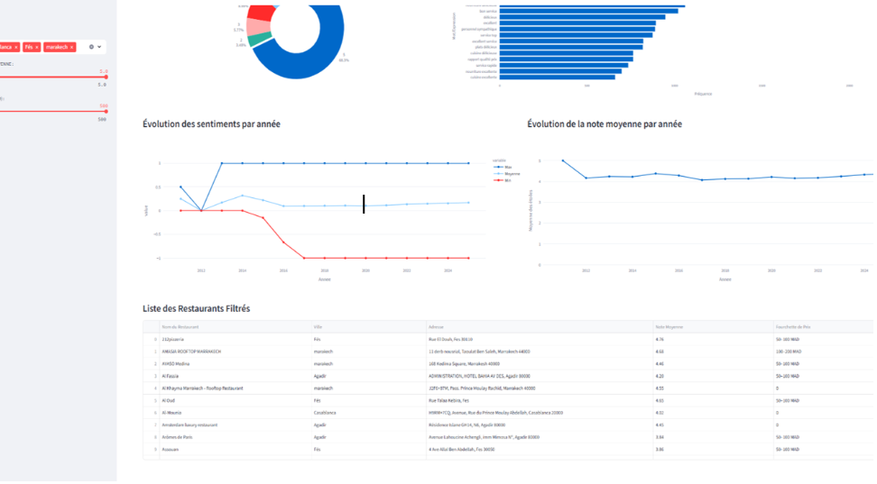
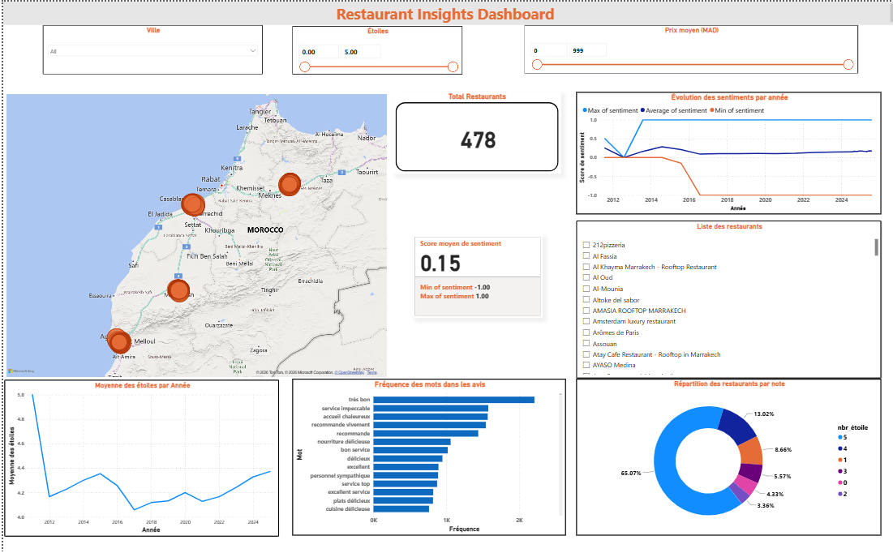
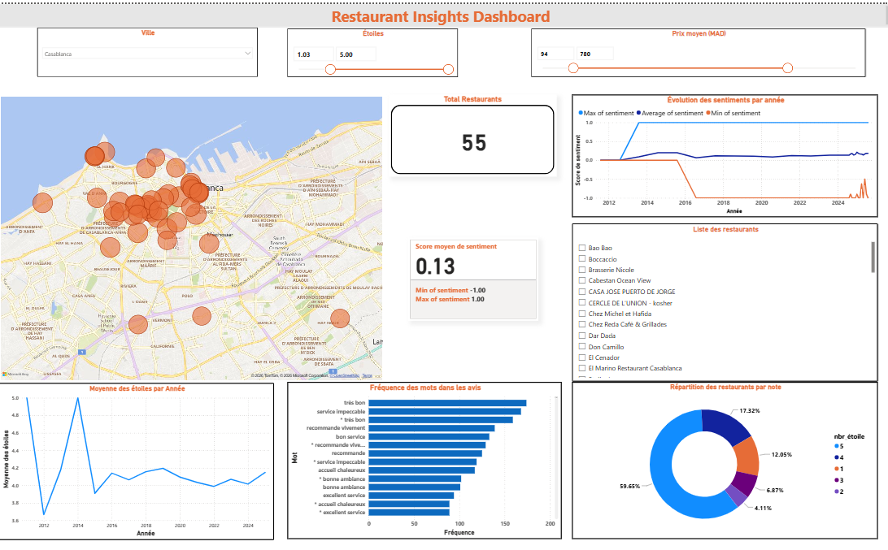

# 🍽️ Analyse de l’e-réputation des restaurants marocains à partir des avis Google
# 📝 Description du projet

Derrière chaque avis publié sur Google se cache une expérience client, une émotion et une attente implicite.
Ce projet vise à exploiter ces milliers de commentaires non structurés afin d’en extraire des insights concrets et mesurables sur la satisfaction client des restaurants marocains.

Il combine web scraping, traitement du langage naturel (NLP), IA générative et visualisation de données pour transformer des avis bruts en outils d’aide à la décision.

# 🎯 Objectifs du projet

- Exploiter automatiquement les avis clients publiés sur Google Maps

- Structurer et fiabiliser des données textuelles hétérogènes

- Mesurer la satisfaction client de manière quantitative

- Identifier les raisons derrière les avis positifs et négatifs

- Offrir une vision claire et exploitable de l’e-réputation des restaurants

# 🔄 Pipeline du projet

Le projet repose sur un pipeline de données complet et reproductible :

- Collecte automatisée des avis, notes et informations Google Maps. 
- Nettoyage et structuration des données pour les rendre exploitables.
- Analyse de sentiment combinant NLP classique et IA générative.
- Visualisation interactive pour l’exploration et l’aide à la décision.

Ce pipeline permet de passer de données brutes non structurées à des indicateurs clairs et actionnables.

# 🛠️ Technologies utilisées

- Python – développement du pipeline

- Selenium – web scraping dynamique de Google Maps

- Pandas & NLTK – nettoyage, normalisation et prétraitement des textes

- TextBlob – analyse de sentiment quantitative

- IA Générative (Gemini API) – extraction d’expressions clés positives et négatives

- Power BI – tableaux de bord décisionnels

- Streamlit – application web interactive

# ⚙️ Fonctionnalités principales

- Collecte automatique de milliers d’avis clients
- Normalisation des notes, dates et fourchettes de prix
- Calcul du sentiment moyen par restaurant
- Extraction des aspects clés mentionnés par les clients (service, prix, qualité, ambiance…)
- Analyse comparative par ville et par niveau de satisfaction
- Exploration interactive des données via filtres et visualisations

# 📊 Outils de visualisation

- Power BI:
Offre une vue synthétique orientée décision avec des KPIs, des graphiques temporels et une cartographie des restaurants.

- Streamlit:
Permet une exploration approfondie des données : filtrage par ville, prix ou satisfaction, analyse des avis et des expressions clés issues de l’IA.

## 📸 Demo

### 🖥️ Streamlit

  
  

### 📊 Power BI

  
  

# 🚀 Valeur ajoutée

Ce projet démontre la capacité à :
-Construire une solution Data end-to-end
-Travailler avec des données réelles, volumineuses et non structurées
-Combiner NLP classique et IA générative
-Transformer des avis clients en leviers d’amélioration concrets
